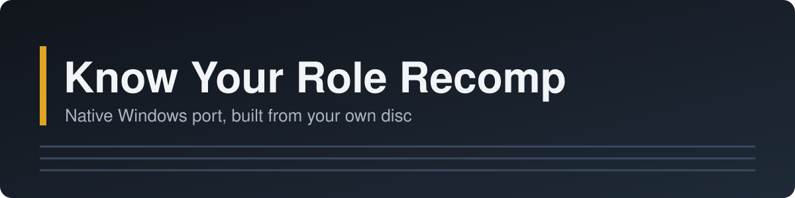

<div align="center">



# Know Your Role Recomp

**Native Windows port of the 2000 PlayStation wrestling game, built from your own disc**

[](https://github.com/Comfubar/KnowYourRoleRecomp/releases/latest)
[](https://github.com/Comfubar/KnowYourRoleRecomp/releases)
[](#what-you-need)
[](LICENSE)
[](https://github.com/Comfubar/KnowYourRoleRecomp/actions/workflows/build.yml)

[](https://github.com/Comfubar/KnowYourRoleRecomp/releases/latest/download/KnowYourRole-win-x64.zip)

</div>

## Contents

- [Download & quick start](#download--quick-start)
- [Features](#features)
- [What you need](#what-you-need)
- [Controllers](#controllers)
- [Controls](#controls)
- [Saves & updating](#saves--updating)
- [Troubleshooting](#troubleshooting)
- [Known issues](#known-issues)
- [Building from source](#building-from-source)
- [License](#license)
- [Disclaimer](#disclaimer)
- [Credits](#credits)

## Download & quick start

**[Download the latest version (KnowYourRole-win-x64.zip)](https://github.com/Comfubar/KnowYourRoleRecomp/releases/latest/download/KnowYourRole-win-x64.zip)**

1. Extract the zip to a folder you can write to, for example `C:\Games\KnowYourRole`.
2. Double-click **KnowYourRole.exe**.
3. Pick your disc image's `.cue` file (the `.bin` next to it is found automatically). The disc is checked, the game
   is built (about three minutes) and then starts. Later, KnowYourRole.exe opens the launcher: press **PLAY**.

You need your own NTSC-U disc image, serial SLUS-01234 (see [What you need](#what-you-need)).

<details>
<summary><b>Installing in detail</b></summary>

- **Check the download** (optional): the release also has `SHA256SUMS.txt`. In a command prompt in the download
  folder run `certutil -hashfile KnowYourRole-win-x64.zip SHA256` and compare the result with the line in it.
- **Where to extract**: a folder you can write to, for example `C:\Games\KnowYourRole`. Not `Program Files`: Windows
  does not let programs write there, and the game keeps its saves in its own folder. Not a folder that OneDrive syncs
  (often `Documents` and `Desktop`): OneDrive would upload the built game (about 250 MB, including the code built
  from your disc, which must not be shared). Setup shows a note when the folder is inside OneDrive.
- **The folder**: `KnowYourRole.exe` (the program you start) and `README.txt`; everything else is in
  `KnowYourRole-files\` (`runtime\` with the game, `user\` with your saves, settings and logs, and the licence files).
- **First run**: setup asks for the disc image, checks the disc and this PC, builds the game (with a progress bar)
  and starts it. When you close the game, the launcher opens.
- **SmartScreen**: Windows may say "Windows protected your PC" because the program is not signed by a known
  publisher. Choose "More info" and "Run anyway".
- Keep the disc image where it is: the game reads it while it runs. If you move it, the launcher asks for it again.

</details>

### The launcher

- **PLAY** starts the game. The launcher comes back when the game closes.
- **Controllers**: one card per player (see [Controllers](#controllers)).
- **Display**: fullscreen or window, VSync.
- **Game files**: change the disc / build the game again, open the saves folder, collect diagnostics, create a
  desktop shortcut, and "start the game right away next time" (skips the launcher; `KnowYourRole.exe --launcher`
  opens it again). The desktop shortcut starts the game directly (`KnowYourRole.exe --play`).

## Features

- **Native code**: the game's MIPS code is translated to C# with the [RecompOne](https://github.com/BlackLabelHQ/RecompOne)
  static recompiler and compiled on your PC. It runs natively on RecompOne's runtime (graphics, sound, CD-ROM,
  controllers and BIOS calls are reimplemented). No emulator core, no BIOS file.
- **One-click setup from your disc**: pick your `.cue`, and the game is checked, built and started.
- **1-4 players**: with 3 or 4 players a multitap is plugged in automatically.
- **Broad controller support** through SDL, with per-player controller cards, live button tests and mapping in the
  launcher, and the game's own vibration.
- **Memory card saves**, kept as files you can back up.
- **Clear error messages** instead of crashes: no usable graphics driver, a read-only folder, a missing Visual C++
  runtime (with an **Install it** button), too little memory or disk space.

What was tested, and how: [docs/STATUS.md](docs/STATUS.md).

## What you need

| | |
|---|---|
| Windows | 10 or 11, 64-bit |
| Graphics | a GPU and driver with OpenGL 3.3 or newer (4.5 is used when available). With a driver that has only OpenGL 2.1 the game starts and its menus draw; a match was not tested on such a driver (see [docs/STATUS.md](docs/STATUS.md)) |
| Memory | 4 GB RAM (measured: building the game peaks at about 0.85 GB; playing uses about 0.8 GB, up to about 1.2 GB) |
| Disk | about 250 MB for the game folder once built (setup asks for 1.5 GB free), plus your disc image |
| Disc | your own NTSC-U disc image, serial SLUS-01234, as `.cue` + `.bin` |
| Runtime | the Microsoft Visual C++ Redistributable (x64), which most PCs already have; if it is missing, setup and PLAY say so and their **Install it** button opens Microsoft's download |

| | |
|---|---|
| Players | 1-4 |
| Region | USA (NTSC-U) |
| Serial | SLUS-01234 |
| Platform | Windows 10/11 x64 |

**Legal**: you must own the game and use your own, legally obtained copy of the disc. This project contains **no
game data**: no code, graphics, sound, video or text from the game. The game is built on your PC from your disc, and
nothing from the disc or built from it ever leaves your PC. Never share game files, disc images or built games (the
`KnowYourRole-files\runtime\Recompiled.*.dll` files), and never upload them in a bug report.

## Controllers

Controllers work through SDL 2.30; no extra driver or remapper is needed. DualShock 4 and DualSense work directly,
without DualSenseX or DS4Windows.

| Controller | USB | Bluetooth |
|---|---|---|
| Xbox 360, Xbox One, Xbox Series X\|S | supported through SDL | supported, not yet hardware-tested |
| DualShock 4 (PS4) | supported through SDL | supported, not yet hardware-tested |
| DualSense (PS5) | tested on hardware (menus and a match) | supported, not yet hardware-tested |
| Switch Pro, Joy-Con pair | supported through SDL | supported, not yet hardware-tested |
| 8BitDo and most other pads | supported through SDL | supported, not yet hardware-tested |
| Generic USB (DirectInput) pads | supported through SDL (map it once, see below) | supported, not yet hardware-tested |
| Keyboard | players 1 and 2 | - |

"Supported through SDL" means the controller family is recognized by SDL and was tested with simulated controllers
that report the same vendor and product IDs; "tested on hardware" means a real controller was used. On the real
DualSense over USB the launcher card, its live button test, the menus and a match (pause, exit) were tested by hand;
vibration, unplugging, the DualSenseX duplicate check, keyboard players, "Map this controller" and in-game
rebinding were tested only with simulated controllers.

In the launcher's **Controllers** tab each player has a card: pick "Automatic" (the next free controller) or a
specific pad, see its family and connection (USB/Bluetooth), and press buttons to test them live.

- **Map this controller**: a pad the game does not know gets a basic layout and a "Map this controller" button: press
  each button when asked, the layout is saved (`KnowYourRole-files\user\gamecontrollerdb.user.txt`) and used from
  then on.
- **Rebinding and deadzone**: the stick deadzone is on the Controllers tab; single buttons can be rebound in the game
  with F1 > System > Settings > Input.
- **Multiplayer**: 2 players plug into ports 1 and 2. With 3 or 4 players a multitap is plugged in automatically
  (Controllers tab: automatic / always / off).
- **One pad controls two players**: a remapper (DualSenseX, DS4Windows, Steam Input) can make one pad appear twice.
  The game detects this and ignores the copy; the launcher card shows it and offers "Ignore this controller". Closing
  the remapper also works.
- **Vibration** follows the game's OPTIONS > VIBRATION setting and the launcher's "Vibration" switch. A DualShock 4
  or DualSense connected by **Bluetooth** only rumbles in an extended mode that stays on until the pad is switched off
  and can confuse other programs, so vibration over Bluetooth is off until you tick "Vibration over Bluetooth for
  PlayStation pads". Over USB it always works.
- **Mouse**: works in the launcher and the in-game settings (F1), not in the game.

## Controls

Buttons go by position: the bottom face button is Cross on every pad.

| PlayStation | Xbox | Nintendo | Keyboard (player 1) | Keyboard (player 2, optional) |
|---|---|---|---|---|
| Cross | A | B | Z | K |
| Circle | B | A | X | L |
| Square | X | Y | A | J |
| Triangle | Y | X | S | I |
| L1 / R1 | LB / RB | L / R | Q / W | U / O |
| L2 / R2 | LT / RT | ZL / ZR | E / R | 7 / 9 |
| L3 / R3 | left / right stick press | stick press | F / G | 8 / 0 |
| Start | Menu | + | Enter | Backspace |
| Select | View | - | right Shift | \ |
| D-pad | D-pad | D-pad | arrow keys | number pad 8 4 5 6 |

The game reads the d-pad only (it has no analog stick support); the left stick works as a d-pad.

| Key | |
|---|---|
| F1 | show or hide the menu bar (System > Settings: Display, Audio, Input, Interface, Paths; Fullscreen; Hard reset; Quit). The Mods and Debug menus belong to the runtime and are not needed to play |
| F11 | fullscreen on/off |

## Saves & updating

Saves and settings live in `KnowYourRole-files\user\` next to `KnowYourRole.exe`: `carda.sav` and `cardb.sav`
(memory cards in slots 1 and 2), `settings.json`, `interface.ini`, `gamecontrollerdb.user.txt`, and `logs\`. To back
up, copy that `user` folder. Launcher > Game files > "Open the saves folder" opens it.

**Updating**: extract the new version over the old folder (or copy your `user` folder into the new one's
`KnowYourRole-files\`). Saves, settings and controller mappings stay. The launcher builds the game again from your
disc once (about three minutes).

**Moving the disc image**: the launcher notices and asks for it again.

## Troubleshooting

<details>
<summary><b>Setup and starting the game</b></summary>

| Problem | What to do |
|---|---|
| "not the NTSC-U (SLUS-01234) release" | Only this release is supported. Other regions and revisions are refused. |
| The disc is accepted with a note about another dump | The game code on it is correct; other data differs from the known dump. It usually plays fine. |
| The build fails | The message says why; the log is in `KnowYourRole-files\user\logs\builder_*.log`. Close other programs if memory is short. |
| "could not start its graphics" | Update your graphics driver (NVIDIA, AMD, Intel). Remote desktop and some virtual machines have no OpenGL. |
| "The Microsoft Visual C++ Redistributable (x64) is not installed" | Install it from Microsoft (https://aka.ms/vs/17/release/vc_redist.x64.exe), then press PLAY again. |
| "cannot run from here" | The folder is in Program Files or another read-only place. Extract the zip to a folder you can write to. |

</details>

<details>
<summary><b>Controllers</b></summary>

| Problem | What to do |
|---|---|
| Not detected | Plug it in before or after starting, both work. Check the launcher's Controllers tab: is it listed? Try another USB port or cable. |
| Wrong buttons | Use "Map this controller" on its card, or rebind in F1 > System > Settings > Input. |
| One pad controls two players | A remapper shows the pad twice. The copy is ignored automatically; use "Ignore this controller" on the card or close the remapper. |
| Bluetooth pad not showing | Pair it first in Windows Settings > Bluetooth & devices. If it still does not appear, try a USB cable. |
| No rumble | Check OPTIONS > VIBRATION in the game and "Vibration" in the launcher. Bluetooth PlayStation pads: tick "Vibration over Bluetooth". |
| A generic pad needs mapping | Its card shows "Map this controller": press each button when asked. |

</details>

**Diagnostics and bug reports**: Launcher > Game files > **Collect diagnostics** (or
`KnowYourRole.exe --collect-diagnostics`) makes a zip with the logs, crash reports and settings. Your Windows user
name, user folder and PC name are removed; saves, the disc and the built game are never included. Open an issue with
the bug report form, title it `[Know Your Role][Issue] Short description`, and attach the zip.

## Known issues

- Bluetooth controllers are supported but not yet tested on real hardware.
- Loading a saved Season with CONTINUE was not confirmed in the latest tests (saving works).
- A graphics driver with only OpenGL 2.1 starts the game and draws the menus; a match was not tested on one.
- The game has no analog stick support of its own; the left stick works as the d-pad.

See [docs/STATUS.md](docs/STATUS.md) for what was tested and what is known not to work.

## Building from source

<details>
<summary><b>Build the game and the launcher yourself</b></summary>

**Prerequisites**: Windows 10 or 11 (x64), the [.NET 10 SDK](https://dotnet.microsoft.com/download/dotnet/10.0),
[git](https://git-scm.com/), and your own disc image.

```
git clone --recurse-submodules https://github.com/Comfubar/KnowYourRoleRecomp.git
cd KnowYourRoleRecomp
```

Put your disc image at `disc\KnowYourRole.cue` (+ `.bin`), then:

```
dotnet build RecompOne/RecompOne.Recompiler -c Release
cd RecompOne/RecompOne.Recompiler
dotnet run -c Release --no-build -- ../../config/KnowYourRole.json
cd ../..
dotnet build KnowYourRole.csproj -m:1
```

This builds `bin\Debug\net10.0\KnowYourRole.Game.exe`. The recompiled code is split into one library per program,
so the build stays under about 2.5 GB of memory (`-m:1`).

**Running it**: start `bin\Debug\net10.0\KnowYourRole.Game.exe` (or `dotnet run --no-build`). The first start shows a
disc picker; pick your `.cue`. Settings, memory cards and logs are kept next to the exe.

**The launcher** (KnowYourRole.exe, setup and launcher in one): `dotnet build Launcher/KnowYourRole.Launcher.csproj -c Release`.
`tools/package-release.ps1` builds the release zip; its audit reads a local list of words no release file may
contain (`.git\info\banned-words.txt`, one per line) and does not run without it.

</details>

## License

The port's code is MIT licensed ([LICENSE](LICENSE)). RecompOne is MIT licensed by its authors and included as a
submodule (a fork with the changes this port needed). The release also contains SDL2, the community
[SDL_GameControllerDB](https://github.com/mdqinc/SDL_GameControllerDB) (zlib license; its notice ships as
`KnowYourRole-files\runtime\gamecontrollerdb.LICENSE.txt`), GLFW, OpenAL Soft and Dear ImGui; see
`KnowYourRole-files\THIRD-PARTY-NOTICES.txt`.

## Disclaimer

This is an unofficial fan project. It is not affiliated with or endorsed by WWE, THQ, JAKKS Pacific, Yuke's or Sony
Interactive Entertainment. All trademarks belong to their owners; names are used only to identify compatibility.

## Credits

Built with [RecompOne](https://github.com/BlackLabelHQ/RecompOne), the PlayStation static recompiler, by its authors.
